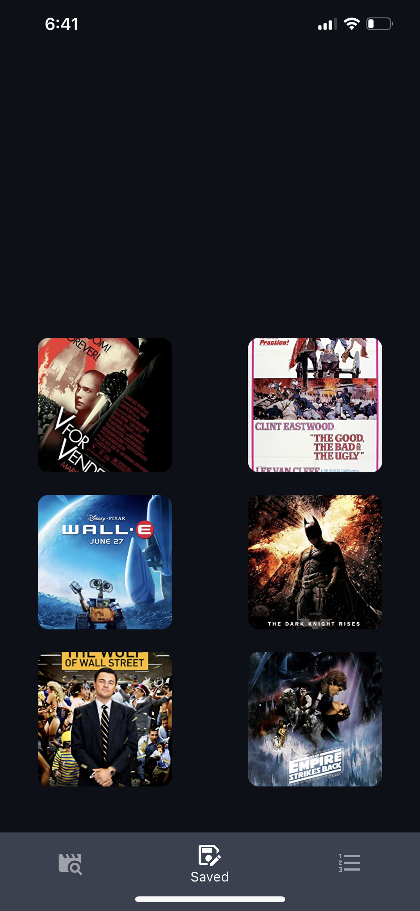

# ts-movie-list

This project is an mobile application written entirely in typescript,
using react-native, expo, nodemon. It allows users to save movies to 
watch list, and search for movies. It also allows for the user to see
some of the following information on a movie:  

* Where to stream it
* Review Scores
* Actors
* Director
* Plot info
* Search for the trailer
* Search on google  

This Files have been documented extensively, even-though typescript creates
automatic documentation through your LSP. The frontend uses the frameworks 
react-native,and expo-cli to compile and run the program. The backend uses 
nodemon and mongodb to host the server. 


## This is what the updated UI should look like.
<div>
    
</div>
  
note: the icons are being clicked on to open external apps
  
  
---
  
Easiest Testing Method will be described below:  
* you need to have a working version of [npm](https://docs.npmjs.com/downloading-and-installing-node-js-and-npm) installed.
* on your mobile device install an application called[ _expo go_ ](https://expo.dev/client) 
* after installing expo on your devide, install the command line interface on
your machine  
```bash
npm install -g expo-go
```
* clone the repo  
```
git clone https://github.com/ndonfris/ts-movie-list.git
```
* cd into the frontend directory  
```bash
cd ts-movie-list/frontend
```
* run the following command to install the dependencies: 
```bash
npm install
```
* after the installation is finished run the following command:
```bash
expo start
```
* lastly use your mobile device with _expo go_ installed onto it to scan the qr code.

  
As pointed out to me on piazza, ios devices don't allow expo links to shared.
Therefore if you are on an device the official link below does not work.
It is recommended the the installation method above is followed but,
for andriod users, the [ __official url__ ](https://expo.dev/@ndonfris29/ts-movie-list?serviceType=classic&distribution=expo-go) might work.


---   

[video submission](https://vimeo.com/manage/videos/680347279)  
  
---
 
Anything below here should not necessary, but may be relevant if you are having
issues.

___
Below shows demos of the three main screens.
Extra information about the installation process can be found below. 

##### Main Application Screens  

### [search](./frontend/routes/SavedRoute.tsx)  

<div align="center">
    
</div>  

___

### [watch list](./frontend/routes/SavedRoute.tsx)  

<div align="center">
    
</div>   

___

### [top 250 imdb](./frontend/routes/BrowseRoute.tsx)  
<div align="center">
    
</div>

___
### Testing/Viewing
1. Go to (https://snack.expo.dev)[https://snack.expo.dev/@ndonfris29/github.com-ndonfris-ts-movie-list:frontend]
1. Navigate to the right side of the webpage.
1. Pick your preferred method of viewing the application (my device, ios,
   andriod, or web).   
    1. It is completely optional to download the expo app, but performance will be
       significantly increased if you choose this method.  

If the above method (using snack) does not work, I have provided a script in this repo that allows for
extremely easy installation of the application.  
___

## Installation of backend

---
To start the entire application you will need to clone the repo and have a
working version of __npm, expo, and ngrok__ installed.
```
sudo apt install expo npm ngrok
pip install pygrok
```

You will also need to run the following commands:
```
cd ts-movie-list/frontend
npm install
cd ../ts-movie-list/backend
npm install
```

afterwards you should be able to view the application by going to the root
directory and running the server_starter executable  
```
./server_starter
```

Further documentation for this script can be found inside of it but in short,
the process automates is the following following steps:
1. `start expo` (for the frontend)
1. starts `nodemon ./backend/source/server.ts` (for the backend)
1. starts ngrok on port 3000 (for communication between frontend and backend)
1. copies ngrok url from `ngrok http 3000` to the __serverURL__ variable defined in frontend/helpers/URL.tsx

---
#### [Frontend](./frontend/)   

__installation__  

If you have cloned the repo and used the installed npm, it should work


---
__usage__

to start only the frontend just run:
`
expo start
`
___

__documentation__


[routes](./frontend/routes/) contain the pages to be rendered  
* [search screen](./frontend/routes/SearchRoute.tsx)
* [saved movies screen](./frontend/routes/SavedRoute.tsx)
* [imdb filter screen](./frontend/routes/SearchRoute.tsx)

[components](./frontend/components/) used on the pages are located in ./components  
_functional components_  
* component used for movie tiles -> [MovieTile.jsx](/frontend/components/MovieTile.tsx)
* component used for rendering the search results -> [MovieList.tsx](/frontend/components/MovieList.tsx)
* component used for the search bar -> [SearchBar.jsx](/frontend/components/SearchBar.tsx)
* component used for rendering a popup when a movie tile is pressed -> [Popup.tsx](/frontend/components/Popup.tsx)
* components used for rendering the information inside of a component are in
    the directory [Popups/](/frontend/components/PopupPages/)
_object oriented components_  
* TODO

---
### [Backend](./backend)  

__installation__

backend was built using: nodemon, mongodb, and rapidapi.com for external api
calls
this means you need a working version of node installed  

```
node -v
npm install nodemon
```
I used yarn as my package manager instead of npm so I also ran:   
```
npm install --global yarn
```

---

__usage__

to start only the backend run:   
```
nodemon ./backend/source/server.ts
```

_note_:  
* for the frontend to communicate with the backend, server_url will need to be updated in the directory ./frontend/helpers/URL.tsx  

* this uses ngrok to communicate through http

* either of the bash scripts ./server_starter will automate setting this up ./startup_script 

* instead of using these scripts you could start up ngrok with the following command:  
```
ngrok http 3000
```
* then you would need to update the frontend/helpers/URL.tsx variable
* so copy the http://url.ngrok.io

___

