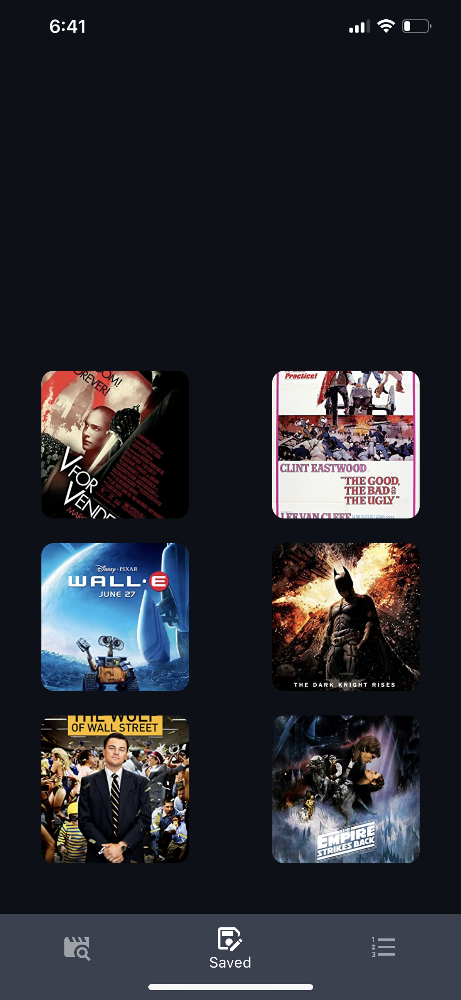

# ts-movie-list

# ios application written entirely in typescript using react-native/expo/nodemon

### Application has three screens  
---
####[search](./frontend/routes/SavedRoute.tsx)  

<div align="center">
    
</div>  

___

#### [watch list](./frontend/routes/SavedRoute.tsx)  

<div align="center">
    
</div>   

___

### [top 250 imdb](./frontend/routes/BrowseRoute.tsx)  
<div align="center">
    
</div>


## Next Goals
* add database
* add popupleft feature for -> find similar movies (rapid api has free imdb-api with this feature)
* [this is the 100% free api to implement](https://rapidapi.com/SAdrian/api/data-imdb1/)
    * get keywords to movie 
    * use getMoviesByKeyword
    * also has man other useful api calls, but only renders {"imdb_id": ..., "title": ...}  
* [switch to this api for searches?](https://rapidapi.com/hmerritt/api/imdb-internet-movie-database-unofficial/)
* add browse onChange feature 
    * [dropdown picker website](https://hossein-zare.github.io/react-native-dropdown-picker-website/docs/usage)
    * [rapid api link - advanced movie search](https://rapidapi.com/jakash1997/api/advanced-movie-search/)
    * [maybe add api for in theaters results](https://rapidapi.com/patriciaatrindade/api/movies115/)


### [Frontend](./frontend/)  
* to start frontend just run:
```bash
sudo apt install expo
expo start
```
* routes contain the pages to be rendered
* components used on the pages are located in ./components

### [Backend](./backend/server)  
* contains backend in ./server  
* to start backend run
```
./helpers/server_starter
```
* server_starter requires __python3, nodemon, and ngrok__ installed
```bash
sudo apt install ngrok
pip install pygrok
```

